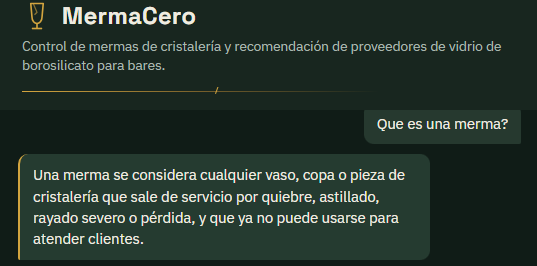
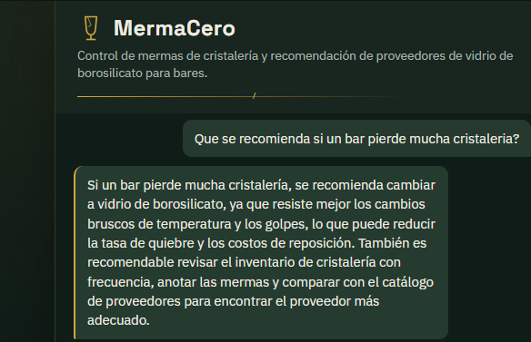
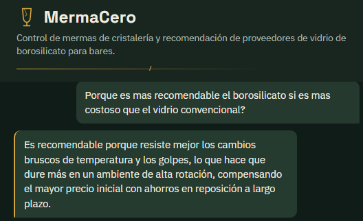
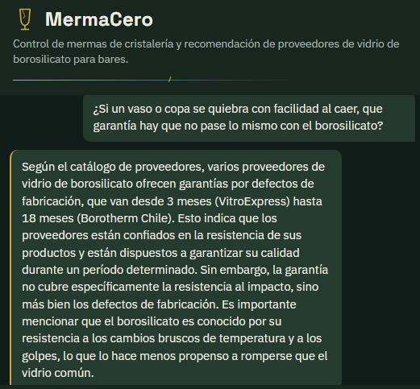
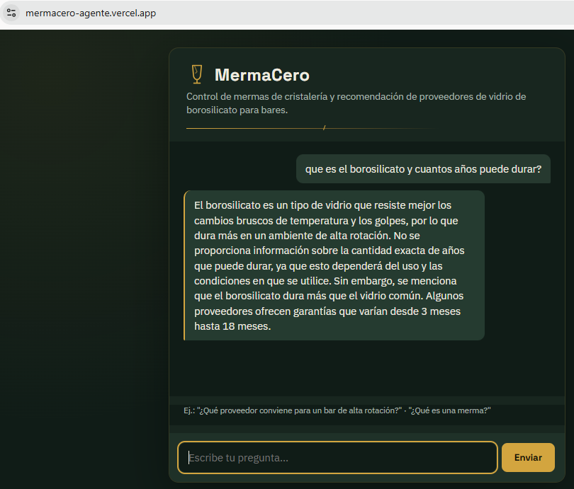

# MermaCero — Agente de IA para control de mermas de cristalería

Challenge final del programa **Oracle Next Education (ONE)** en alianza con **Alura**.

## Descripción general

MermaCero es un agente de inteligencia artificial pensado para dueños de bares y restobares. Responde preguntas sobre:

- Qué es una merma de cristalería y cuáles son sus causas más comunes.
- Cómo calcular el costo mensual de las pérdidas de vasos y copas.
- Cuándo conviene cambiar a vidrio de borosilicato.
- Qué proveedor de vidrio de borosilicato conviene según precio, tiempo de entrega, cantidad mínima de pedido o garantía.

El agente responde exclusivamente en base al contenido de dos documentos fuente: un FAQ en PDF y un catálogo de proveedores en CSV.

## Arquitectura de la solución

```
Usuario (navegador)
      │
      ▼
Flask (app.py) ── /chat (POST) ──► document_loader.py
      │                                 │
      │                    lee data/*.csv y data/*.pdf
      │                                 │
      ▼                                 ▼
Groq API (Llama 3.3 70B) ◄──── contexto (system prompt)
      │
      ▼
Respuesta en JSON → interfaz de chat (templates/index.html)
```

El contexto de los documentos se carga una sola vez al iniciar la aplicación y se inyecta en el `system prompt` de cada consulta al modelo. No se usa una base de datos vectorial: dado el tamaño acotado de los documentos, se pasa el contenido completo como contexto.

## Tecnologías utilizadas

- **Python 3 / Flask** — servidor y endpoint del agente
- **Groq API (Llama 3.3 70B)** — modelo de lenguaje que genera las respuestas (free tier, sin tarjeta de pago)
- **pypdf** — extracción de texto del documento PDF
- **csv (librería estándar)** — lectura del catálogo de proveedores
- **HTML/CSS/JS vanilla** — interfaz de chat mínima
- **Vercel** — hosting de la aplicación

## Instrucciones para ejecutar el proyecto

```bash
# 1. Clonar el repositorio
git clone <URL_DEL_REPO>
cd mermacero-agente

# 2. Crear entorno virtual e instalar dependencias
python3 -m venv .venv
source .venv/bin/activate        # En Windows: .venv\Scripts\activate
pip install -r requirements.txt

# 3. Configurar variables de entorno
cp .env.example .env
# Editar .env y completar GROQ_API_KEY con tu propia API key
# (se obtiene gratis, sin tarjeta, en https://console.groq.com/keys)

# 4. Ejecutar la aplicación
python app.py
# La app queda disponible en http://localhost:5000
```

## Ejemplos de preguntas que el agente puede responder

- "¿Qué es una merma de cristalería?"
- "¿Cuánto cuesta reponer 40 vasos rocks al mes?"
- "¿Qué proveedor conviene para un bar de alta rotación con entrega rápida?"
- "¿Qué garantía ofrece Andes Glass Supply?"
- "¿Cuándo conviene cambiar a vidrio de borosilicato?"

## Ejemplos de respuestas generadas por el agente






**Pregunta:** ¿Qué proveedor conviene para un bar de alta rotación con entrega rápida?
**Respuesta:** Convendría un proveedor que ofrezca vidrio de borosilicato con entrega rápida y resistencia a choques térmicos y golpes. Considerando estos requisitos, algunos proveedores que podrían ser adecuados son:

- VitroExpress: Entrega en 3 días, pero con un pedido mínimo de 300 unidades y solo para vasos shot.
- GlassPro Express: Entrega en 4 días, con un pedido mínimo de 250 unidades y ofrece un set mixto.
- Borosilicato del Pacífico: Entrega en 5 días, con un pedido mínimo de 200 unidades y ofrece vasos highball.

Es importante evaluar el tipo de vidrio necesario y el pedido mínimo para tomar la mejor decisión según las necesidades del bar.

## Deploy en VERCEL

Aplicación desplegada en Vercel:

- Enlace público: https://mermacero-agente.vercel.app/
- Captura de pantalla de la aplicación funcionando: 


## Estructura del repositorio

```
mermacero-agente/
├── app.py                  # Servidor Flask y endpoint /chat
├── document_loader.py       # Lectura y procesamiento del CSV y PDF fuente
├── requirements.txt
├── .env.example
├── .gitignore
├── data/
│   ├── catalogo_proveedores_borosilicato.csv
│   └── faq_control_mermas_cristaleria.pdf
├── templates/
│   └── index.html           # Interfaz de chat
└── README.md
```

Aplicación creada por: Johanna González 💻